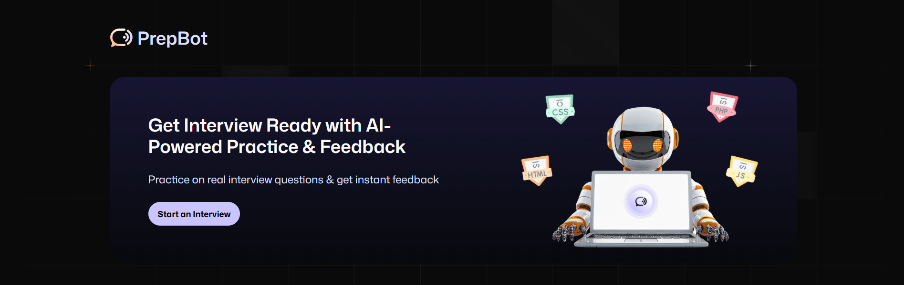
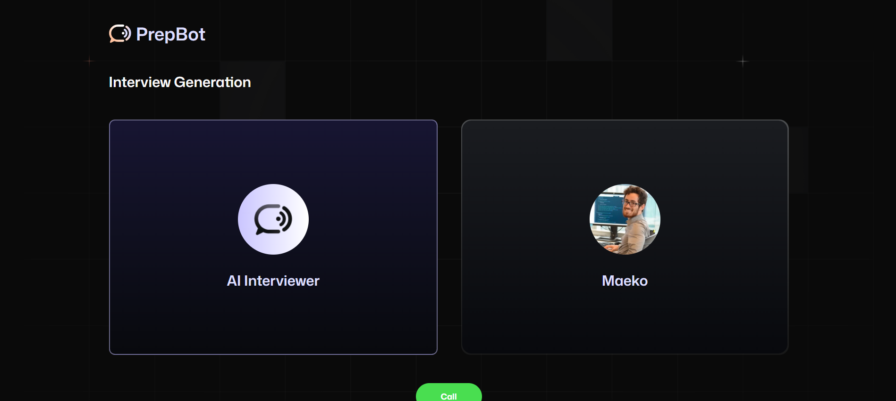

# 🎯 PrepBot - AI Interview Preparation Platform

A free, responsive AI-powered interview preparation platform that helps you practice and improve your interview skills anytime, anywhere. Built with modern web technologies and voice AI integration.



**Explore the powerful features of VAPI AI Agents**



## 🌟 Overview

PrepBot is designed to be your personal interview coach, leveraging AI voice technology to simulate real interview scenarios. Whether you're preparing for your next job opportunity or just want to sharpen your interview skills, PrepBot provides a comprehensive platform for practice and improvement.

## ⚙️ Tech Stack

- **Frontend**: Next.js 14 with TypeScript
- **Styling**: Tailwind CSS + shadcn/ui components
- **Database**: Firebase Firestore
- **Authentication**: Firebase Auth
- **Voice AI**: Vapi AI Platform
- **AI Generation**: Google Gemini AI
- **Validation**: Zod
- **Date Handling**: Day.js
- **Animations**: Tailwind CSS Animate

## 🔋 Features

👉 **Authentication**: Secure sign up and sign in using email/password authentication powered by Firebase

👉 **AI Interview Generation**: Create personalized job interviews with the help of Vapi voice assistants and Google Gemini AI

👉 **Voice-Powered Interviews**: Conduct realistic interview sessions with AI voice agents that respond naturally to your answers

👉 **Instant AI Feedback**: Receive detailed, constructive feedback based on your interview performance and conversation quality

👉 **Modern UI/UX**: Sleek, intuitive interface with smooth animations and responsive design

👉 **Interview Dashboard**: Manage and track all your interviews with easy navigation and organization

👉 **Real-time Transcripts**: View live conversation transcripts during interviews for better engagement

👉 **Interview History**: Access past interviews and feedback to track your improvement over time

👉 **Cross-Device Compatibility**: Fully responsive design that works seamlessly on desktop, tablet, and mobile

👉 **Reusable Components**: Clean, modular code architecture for easy maintenance and scalability

## 🚀 Getting Started

### Prerequisites

- Node.js 18+ and npm
- Firebase account
- Vapi AI account
- Google AI Studio account (for Gemini API)

### Installation

1. **Clone the repository**
   ```bash
   git clone https://github.com/RupErz/PrepBot.git
   cd prepbot
   ```

2. **Install dependencies**
   ```bash
   npm install
   ```

3. **Install required packages**
   ```bash
   # Core dependencies
   npm install firebase firebase-admin
   npm install ai @ai-sdk/google
   npm install @vapi-ai/web-sdk
   npm install dayjs zod
   npm install tailwindcss-animate
   
   # shadcn/ui components
   npx shadcn@latest add button form input sonner
   ```

4. **Set up environment variables**
   
   Create a `.env.local` file in the root directory:
   ```env
   # Firebase Configuration
   NEXT_PUBLIC_FIREBASE_API_KEY=your_api_key
   NEXT_PUBLIC_FIREBASE_AUTH_DOMAIN=your_auth_domain
   NEXT_PUBLIC_FIREBASE_PROJECT_ID=your_project_id
   NEXT_PUBLIC_FIREBASE_STORAGE_BUCKET=your_storage_bucket
   NEXT_PUBLIC_FIREBASE_MESSAGING_SENDER_ID=your_sender_id
   NEXT_PUBLIC_FIREBASE_APP_ID=your_app_id
   
   # Firebase Admin SDK
   FIREBASE_ADMIN_PRIVATE_KEY=your_private_key
   FIREBASE_ADMIN_CLIENT_EMAIL=your_client_email
   FIREBASE_ADMIN_PROJECT_ID=your_project_id
   
   # Vapi Configuration
   NEXT_PUBLIC_VAPI_PUBLIC_KEY=your_vapi_public_key
   VAPI_WORKFLOW_ID=your_workflow_id
   
   # Google Gemini AI
   GOOGLE_GENERATIVE_AI_API_KEY=your_gemini_api_key
   ```

5. **Configure Firebase**
   - Create a new Firebase project
   - Enable Authentication with Email/Password
   - Set up Firestore Database
   - Generate Firebase Admin SDK credentials

6. **Set up Vapi Workflow**
   - Create a Vapi account
   - Design your interview workflow
   - Configure the AI assistant with appropriate prompts
   - Save the workflow ID to your environment variables

7. **Run the development server**
   ```bash
   npm run dev
   ```

   Open [http://localhost:3000](http://localhost:3000) in your browser.

## 🏗️ Project Structure

```
prepbot/
├── app/                          # Next.js app directory
│   ├── (auth)/                   # Authentication route group
│   │   ├── sign-in/
│   │   └── sign-up/
│   ├── interview/[id]/           # Dynamic interview routes
│   │   └── feedback/
│   ├── api/                      # API routes
│   │   └── vapi/generate/
│   └── globals.css
├── components/                   # Reusable components
│   ├── ui/                       # shadcn/ui components
│   ├── Agent.tsx                 # Main voice AI component
│   ├── InterviewCard.tsx
│   └── FormField.tsx
├── lib/                          # Utilities and configurations
│   ├── firebase/
│   │   ├── client.ts
│   │   └── admin.ts
│   ├── auth.actions.ts           # Authentication server actions
│   ├── general.actions.ts        # General server actions
│   └── utils.ts
├── constants/                    # App constants and prompts
├── types/                        # TypeScript type definitions
└── public/                       # Static assets
```

## 📱 Usage

### Creating Your First Interview

1. **Sign up** for a new account or **sign in** to existing one
2. Navigate to the **Generate Interview** section
3. Specify your interview preferences (role, tech stack, experience level)
4. Click **"Generate Interview"** to create AI-powered questions
5. Start your interview session with the voice AI assistant

### Taking an Interview

1. Select an interview from your dashboard or recent interviews
2. Click **"Start Interview"** to begin the voice session
3. Speak naturally with the AI interviewer
4. View real-time transcripts during the conversation
5. Receive instant feedback after completion

### Viewing Feedback

1. Complete an interview session
2. Navigate to the feedback page
3. Review detailed AI-generated feedback
4. Track your improvement over time
5. Retake interviews to practice specific areas

## 🔧 Key Components

### Voice AI Integration (Agent.tsx)
- Manages Vapi SDK integration
- Handles call states and status
- Real-time transcript processing
- Voice activity detection

### Authentication System
- Firebase Auth integration
- Secure session management with cookies
- Protected route handling
- Server-side authentication verification

### Interview Generation
- Google Gemini AI integration
- Custom prompt engineering
- Firestore data persistence
- Dynamic question generation

## 📄 License

This project is licensed under the MIT License - see the [LICENSE](LICENSE) file for details.

## 🙏 Acknowledgments

- [Vapi AI](https://vapi.ai/) for voice AI capabilities
- [Google Gemini](https://ai.google.dev/) for AI-powered question generation
- [Firebase](https://firebase.google.com/) for backend services
- [shadcn/ui](https://ui.shadcn.com/) for beautiful UI components
- [Vercel AI SDK](https://sdk.vercel.ai/) for seamless AI integration

**Made with ❤️ by Nghia Vu**

*Prepare for success, one interview at a time.*